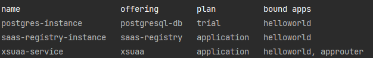

### [Create an Application with SAP Java Buildpack](https://developers.sap.com/tutorials/btp-cf-buildpacks-java-create.html)   
Simple Java application by using cf CLI via Spring Boot.
- This simple app will be invoked through a web microservice (application router).
- This app will set authentication checks and an authorization role to properly access
your web application.

### Add XSUAA authorisation service:
> cf create-service xsuaa application xsuaa-service -c xs-security.json  
> cf unbind-service 'application' xsuaa-service 
> cf delete-service 'xsuaa-service'

Where:  
- 'xsuaa-service' is name of xsuaa service in SAP BTP  
- 'application' is an application name


### Build project:  
1. In 'web' run commands which will create package.json and add approuter service:
> npm init  
> npm install @sap/approuter --save  
> 
2. In the root run:
> mvn clean install

### Deploy app to SAP BTP Cloud Foundry:  
1. Set the Cloud Foundry API endpoint for your subaccount on SAP BTP:  
> cf api https://api.cf.eu20.hana.ondemand.com  
> cf login or cf login --sso  

2. Deploy java application on SAP BTP Cloud Foundry:  
> cf push  

### [Using Postman for API Testing with XSUAA](https://blogs.sap.com/2020/03/02/using-postman-for-api-testing-with-xsuaa/)  
Read values from the environment variable of the application:
> cf env app_name

- open Postman
- create Get request
- http field: put link on approuter from BTP Cloud Foundry

- authorisation tab:  
- - Grant Type: 'Password credential'
- - Access Token URL = xsuaa[0].credentials.url + "/oauth/token"
- - Client ID = xsuaa[0].credentials.clientid
- - Client Secret = xsuaa[0].credentials.clientsecret
- - Scope = xsuaa[0].credentials.xsappname + ".admin"


### [Add Multi-tenancy](https://developers.sap.com/tutorials/cp-cf-security-xsuaa-multi-tenant.html)
### Add SaaS Provisioning service
Create config.json is a configuration file for SaaS Provisioning service
```
{
  "xsappname":"helloworld",
  "appUrls": {
    "onSubscription" : "https://helloworld-ap25.cfapps.eu10.hana.ondemand.com/callback/v1.0/tenants/{tenantId}"
  },
  "displayName" : "Helloworld MTA",
  "description" : "Helloworld MTA sample application",
  "category" : "Custom SaaS Applications"
}
```
Create the SaaS Provisioning service instance with the config.json file:  
> cf create-service saas-registry application saas-registry-instance -c config.json

Create a route for a consumer subaccount:  
> cf map-route 'approuter_name' cfapps.eu10.hana.ondemand.com --hostname 'subaccount_subdomain'-'first_part_of_approuter_rout'

Useful commands:
>cf logs 'appicationname'
> cf logs 'appname' --recent //show logs from SAP BTP  
> cf marketplace //show available services  
> cf marketplace -s postgresql //show info about one service  
> cf create-service postgresql v9.6-dev postgres  

> cf bind-service helloworld postgres-instance //connect two services
> cf services //show services in your dev spase
>   
> cf apps //show downloaded apps

### Add log service from SAP BTP
>cf marketplace  
>cf create-service application-logs lite 'myapplogs'  
>cf services  
>cf bind-service 'appname' 'myapplogs'  
>cf restage 'appname'  

### Additional resources
[Deep Dive 6 with SAP Cloud SDK: Extend your Cloud Foundry Application with Tenant-Aware Persistency](https://blogs.sap.com/2017/12/20/deep-dive-6-with-sap-s4hana-cloud-sdk-extend-your-cloud-foundry-application-with-tenant-aware-persistency/)

TODO:
tenantId vs subdoman?
Alexandr where  is your dependencies for QueryDSL?