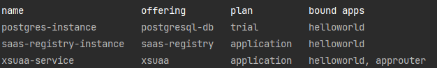
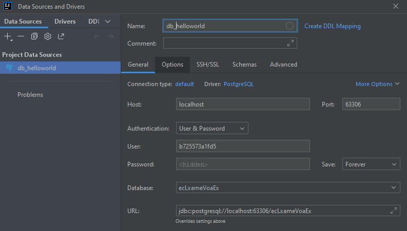
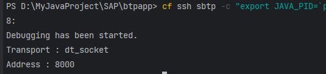
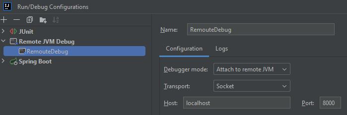
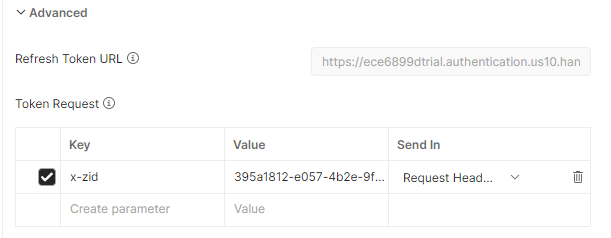

# spring-boot-mutlitenancy-app

## Description
This is a test project about implementing Java backend microservices on SAP BTP Cloud
Foundry Platform.

## Project details

* [Guide to developing cloud applications using SAP Cloud Platform and Cloud Foundry.](https://habr.com/ru/companies/sap/articles/350690/)
* Spring-Boot Crud operations
* Deployment on Cloud Foundry (SAP BTP)
* O-Auth 2.0 protocol (XSUAA service)
* SaaS multi-tenant application (Schema isolation), saas-registry service

### [Create an Application with SAP Java Buildpack](https://developers.sap.com/tutorials/btp-cf-buildpacks-java-create.html)   
Simple Java application by using cf CLI via Spring Boot.
- This simple app will be invoked through a web microservice (application router).
- This app will set authentication checks and an authorization role to properly access
your web application.

### Add XSUAA authorisation service:
> cf create-service xsuaa application xsuaa-service -c xs-security.json  
> cf unbind-service 'app_name' xsuaa-service 
> cf delete-service 'xsuaa-service'

Where:  
- 'xsuaa-service' is name of xsuaa service in SAP BTP  
- 'application' is an application name


### Build project:  
1. In 'web' run commands which will create package.json and add approuter service:
> npm init  
> npm install @sap/approuter --save  
> 
2. In the root run:
> mvn clean install

### Deploy app to SAP BTP Cloud Foundry:  
1. Set the Cloud Foundry API endpoint for your subaccount on SAP BTP:  
> cf api https://api.cf.eu20.hana.ondemand.com  
> cf login or cf login --sso  

2. Deploy java application on SAP BTP Cloud Foundry: 
> mvn clean install
> cf push  

### [Using Postman for API Testing with XSUAA](https://blogs.sap.com/2020/03/02/using-postman-for-api-testing-with-xsuaa/)  
Read values from the environment variable of the application:
> cf env app_name

- open Postman
- create Get request
- http field: put link on approuter from BTP Cloud Foundry

- authorisation tab:  
- - Grant Type: 'Password credential'
- - Access Token URL = xsuaa[0].credentials.url + "/oauth/token"
- - Client ID = xsuaa[0].credentials.clientid
- - Client Secret = xsuaa[0].credentials.clientsecret
- - Scope = xsuaa[0].credentials.xsappname + ".admin"


Useful commands:
> cf logs <app name>
> cf logs <app name> --recent //show logs from SAP BTP  
> cf marketplace //show available services  
> cf marketplace -s postgresql //show info about one service  
> cf events <app name> //show events
> cf create-service postgresql v9.6-dev postgres
> cf bind-service <app name> <postgres-instance> //connect two services

> cf services //show services in your dev spase
>   
> cf apps //show downloaded apps
> cf app <app name> //show statistics

### Add log service from SAP BTP
> cf marketplace  
> cf create-service application-logs lite 'myapplogs'  
> cf services  
> cf bind-service 'appname' 'myapplogs'  
> cf restage 'appname'  

### Persistence 
[Deep Dive 6 with SAP Cloud SDK: Extend your Cloud Foundry Application with Tenant-Aware Persistency](https://blogs.sap.com/2017/12/20/deep-dive-6-with-sap-s4hana-cloud-sdk-extend-your-cloud-foundry-application-with-tenant-aware-persistency/)
> cf create-service postgresql-db trial postgres-instance
> cf bind-service sbtp postgres-instance //if you write it in manifest then ut will be automatically
> cf restage sbtp

where:
  * sbtp is APP_NAME in BTP CLoud Foundry
  * postgresql-db <- name from: cf marketplace  
  * trial <- your plan in BTP Cockpit
  * postgres-instance <- name of your new instance 'postgresql-db'

### [Connect to database running on Cloud Foundry locally through ssh:](https://docs.cloudfoundry.org/devguide/deploy-apps/ssh-services.html#ssh-tunnel)
<details><summary> Expand </summary>

1. Activate SSH for your app:
> cf enable-ssh sbtp

2. Create a service key for your service instance using the cf create-service-key command:
> cf create-service-key <service_instance_name_in_BTP> <my_new_key_name>

3. Retrieve your new service key using the cf service-key command:
> cf service-key <service_instance_name_in_BTP> <my_new_key_name>

4. Open SSH connection:
> cf ssh -L <local_port>:<service_hostname>:<service_port> <app_name>  
> like:  
> cf ssh -L 63306:postgres-ade9561e-2985-4c20-b601-097eee32029a.cqryblsdrbcs.us-east-1.rds.amazonaws.com:4605 sbtp  

* <local_port> is available local port for port forwarding. For example, 63306
* <service_hostname> is the address provided under hostname in the service key retrieved earlier.  
* <service_port> is the port provided under port.  
* <app_name> is the name of your app in SAP BTP.  

5. Access your service instance from Intelij Idea
   
</details>


### [Add Multi-tenancy](https://developers.sap.com/tutorials/cp-cf-security-xsuaa-multi-tenant.html)
1. Add SaaS Provisioning service
Create config.json is a configuration file for SaaS Provisioning service
```
{
  "xsappname":"helloworld",
  "appUrls": {
    "onSubscription" : "https://helloworld-ap25.cfapps.eu10.hana.ondemand.com/callback/v1.0/tenants/{tenantId}"
  },
  "displayName" : "Helloworld MTA",
  "description" : "Helloworld MTA sample application",
  "category" : "Custom SaaS Applications"
}
```
Create the SaaS Provisioning service instance with the config.json file:
> cf create-service saas-registry application saas-registry-instance -c config.json

2. Create a route for a consumer subaccount:
> cf map-route 'approuter_name' cfapps.us10-001.hana.ondemand.com --hostname 'subaccount_subdomain'-'first_part_of_approuter_rout'


### [Debug an Application Running on SapMachine:](https://help.sap.com/docs/btp/sap-business-technology-platform/debug-java-web-application-running-on-sapmachine)
<details><summary> Expand </summary>

1. Configure application for debugging. Add setting to manifest.yaml:  
```
JBP_CONFIG_JAVA_OPTS: "[java_opts: '-agentlib:jdwp=transport=dt_socket,address=8000,server=y,suspend=n,onjcmd=y']"
env:
  JBP_CONFIG_SAP_MACHINE_JDK: "[default_debug_agent_active: true]"
```
2. Redeploy application: 
> cf push
3. Enter in file system of a remote app:  
> cf ssh < app name >
4. Move to 'bin' directory:  
> cd app/META-INF/.sap_java_buildpack/sap_machine_jdk/bin
5. Run the following command to found $JAVA_PID of debug process:  
'META-INF/.sap_java_buildpack/sap_machine_jdk/bin/java'
> ps aux  
> exit
6. Start the debug process. Replace $JAVA_PID on your number, and <app_name>:
> cf ssh sbtp -c "export JAVA_PID=`ps java pid=` && app/META-INF/.sap_java_buildpack/sap_machine_jdk/bin/jcmd $JAVA_PID VM.start_java_debugging"  



7. Open SSH connection to debug process:
> cf ssh -N -T -L 8000:localhost:8000 <app_name>

8. Edit configuration for the debug process in Intellij IDEA:
   
</details>


## Mutlitenancy testing using by Postman

<details><summary> Expand </summary> 

1. Prepare request like this [Using Postman for API Testing with XSUAA]
> https://sbtp-app-rout.cfapps.us10-001.hana.ondemand.com
2. Delete scope
3. Change 'Grand Type' to 'Client credentials'
4. Expand 'advanced' and create parameter x-zid, value is a subaccount tenant ID in CF:  

5. Get token for current tenant and use it on route of application
   (You can parse your token by [JWT.io](https://jwt.io), and check "x-zid" section to make sure that you have correct tenantId):  
> https://sbtp-app-rout.cfapps.us10-001.hana.ondemand.com/books


</details>


## [Migration from manifest.yaml to mtad.yaml](https://help.sap.com/docs/SAP_HANA_PLATFORM/4505d0bdaf4948449b7f7379d24d0f0d/33548a721e6548688605049792d55295.html)

## Tests generation using plugin Sapient AI
[Home page](https://plugins.jetbrains.com/plugin/21709-sapient-ai-test-coder)
[Installation and Documentation](https://github.com/Sapient-AI/docs)

### Additional resources:
1. [Fundamentals of Multitenancy in SAP BTP](https://blogs.sap.com/2022/08/27/fundamentals-of-multitenancy-in-sap-btp/)
2. [Guide to Developing Cloud Applications with SAP Cloud Platform and Cloud Foundry](https://habr.com/ru/companies/sap/articles/350690/)
3. [Remote Debugging on Cloud Foundry](https://blogs.sap.com/2019/07/24/remote-debugging-on-cloud-foundry/)


